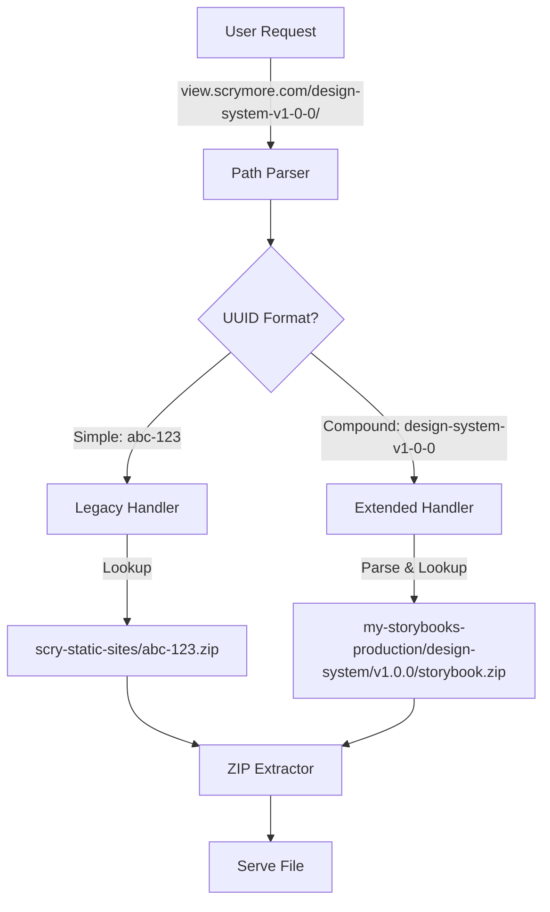
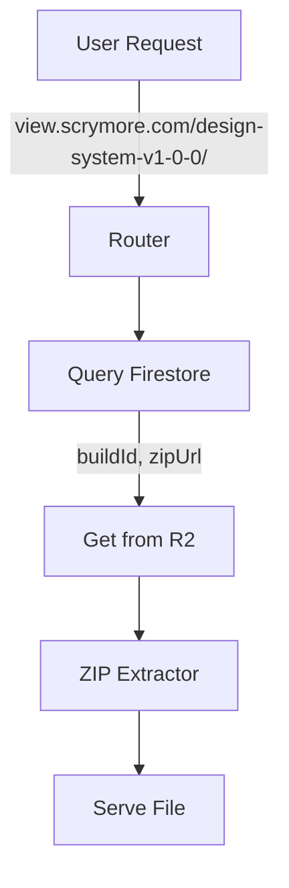
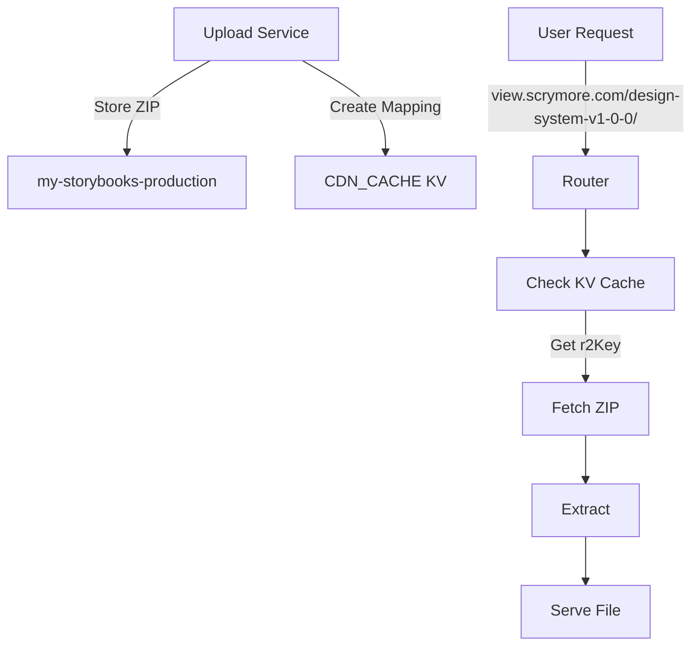

# Upload Service Integration - Architecture Options

**Date:** 2025-10-31  
**Purpose:** Compare integration approaches between Upload Service and View Service

---

## Executive Summary

We need to integrate two services:
- **Upload Service**: Stores Storybook ZIPs at `my-storybooks-production/{project}/{version}/storybook.zip`
- **View Service**: Currently expects ZIPs at `scry-static-sites/{uuid}.zip`

**Goal:** When a Storybook is uploaded, it should automatically be viewable at `view.scrymore.com/{predictable-url}/`

**Constraint:** Single storage location (no file duplication)

---

## Current State Analysis

### Upload Service Storage Pattern
```
my-storybooks-production/
  └── design-system/
      ├── v1.0.0/
      │   └── storybook.zip
      ├── v1.1.0/
      │   └── storybook.zip
      └── v2.0.0/
          └── storybook.zip
```

### View Service Storage Pattern
```
scry-static-sites/
  ├── storybook.zip          → view.scrymore.com/storybook/
  ├── my-app-v2.zip          → view.scrymore.com/my-app-v2/
  └── abc-123.zip            → view.scrymore.com/abc-123/
```

### Key Differences
1. **Path Structure**: Upload uses nested paths, View uses flat
2. **Filename**: Upload uses `storybook.zip`, View uses `{uuid}.zip`
3. **Bucket**: Different R2 buckets
4. **Metadata**: Upload tracks in Firestore, View caches in KV

---

## Option 1: Extended Path Resolution (RECOMMENDED)

### Overview
Modify the View Service to support BOTH storage patterns:
- Legacy: `scry-static-sites/{uuid}.zip`
- New: `my-storybooks-production/{project}/{version}/storybook.zip`

### Architecture



### Implementation Details

**URL Pattern Parsing:**
```typescript
// Legacy: view.scrymore.com/{uuid}/
//   → scry-static-sites/{uuid}.zip

// Extended: view.scrymore.com/{project}-{version}/
//   → my-storybooks-production/{project}/{version}/storybook.zip

// Examples:
// view.scrymore.com/design-system-v1-0-0/
//   → my-storybooks-production/design-system/v1.0.0/storybook.zip

// view.scrymore.com/design-system-v1-1-0/
//   → my-storybooks-production/design-system/v1.1.0/storybook.zip
```

**Configuration Required:**
- Add `UPLOAD_BUCKET` env var pointing to `my-storybooks-production`
- Bind second R2 bucket in wrangler.toml
- Create path resolution logic to detect format

**Code Changes:**
1. Update [`parsePathForUUID()`](../src/utils/subdomain.ts) to detect compound UUIDs
2. Add bucket routing logic in [`zip-static.ts`](../src/routes/zip-static.ts)
3. Update storage adapter to support multiple buckets

### Pros ✅
- **No data duplication** - Files stay in upload bucket
- **Backward compatible** - Existing URLs continue working
- **Automatic integration** - No manual sync needed
- **Single source of truth** - Upload service owns the data
- **Firestore metadata** - Can query build info directly
- **Simple URL mapping** - Predictable pattern from project/version

### Cons ❌
- **More complex routing** - Need to handle two patterns
- **Dependency coupling** - View service depends on upload bucket structure
- **Multiple bucket bindings** - Slight performance overhead
- **Path parsing complexity** - Need to convert `design-system-v1-0-0` ↔ `design-system/v1.0.0`

### Estimated Effort
- **Development:** 4-6 hours
- **Testing:** 2-3 hours
- **Documentation:** 1-2 hours
- **Total:** ~1 day

---

## Option 2: Firestore-Driven Lookup

### Overview
Use Firestore as the source of truth for URL-to-storage mapping. View service queries Firestore to find the actual ZIP location.

### Architecture



### Implementation Details

**Firestore Schema:**
```typescript
// Query by friendly URL slug
projects/design-system/builds/{buildId}
{
  versionId: "v1.0.0",
  friendlySlug: "design-system-v1-0-0",  // NEW FIELD
  zipUrl: "https://pub-my-storybooks-production.../design-system/v1.0.0/storybook.zip",
  r2Key: "design-system/v1.0.0/storybook.zip",
  buildNumber: 1
}
```

**URL Resolution:**
```typescript
// 1. Parse URL: view.scrymore.com/design-system-v1-0-0/
// 2. Query Firestore for friendlySlug = "design-system-v1-0-0"
// 3. Get r2Key from build record
// 4. Fetch from my-storybooks-production/{r2Key}
```

**Configuration Required:**
- Add Firestore client to View Service
- Bind `UPLOAD_BUCKET` in wrangler.toml
- Add Firestore credentials

### Pros ✅
- **Flexible mapping** - Can change URL structure without moving files
- **Rich metadata** - Access build numbers, timestamps, etc.
- **Validation** - Can check if build is active/archived
- **Analytics ready** - Track view counts in Firestore
- **Decoupled storage** - Storage structure can change independently

### Cons ❌
- **Additional dependency** - View service needs Firestore access
- **Latency overhead** - Extra Firestore query per request (mitigated by KV cache)
- **Data consistency** - Must keep Firestore and R2 in sync
- **More complex setup** - Requires Firestore credentials and permissions
- **Single point of failure** - Firestore outage affects viewing

### Estimated Effort
- **Development:** 6-8 hours
- **Testing:** 3-4 hours
- **Documentation:** 2-3 hours
- **Total:** ~2 days

---

## Option 3: Hybrid with KV Mapping

### Overview
Maintain a lightweight KV mapping from friendly URLs to R2 paths. Upload service creates mapping when uploading.

### Architecture



### Implementation Details

**KV Mapping Schema:**
```typescript
// Key: "route:{slug}"
// Value: { bucket, key, metadata }

await KV.put(
  "route:design-system-v1-0-0",
  JSON.stringify({
    bucket: "my-storybooks-production",
    key: "design-system/v1.0.0/storybook.zip",
    project: "design-system",
    version: "v1.0.0",
    createdAt: "2025-10-31T00:00:00Z"
  })
);
```

**Upload Service Changes:**
Add webhook/endpoint to create KV mapping after successful upload:

```typescript
// In upload service after ZIP upload
await fetch('https://view.scrymore.com/api/register', {
  method: 'POST',
  body: JSON.stringify({
    slug: 'design-system-v1-0-0',
    bucket: 'my-storybooks-production',
    key: 'design-system/v1.0.0/storybook.zip'
  })
});
```

### Pros ✅
- **Fast lookup** - KV is extremely fast, no Firestore query
- **Loose coupling** - Services communicate via simple API
- **Flexible** - Easy to add custom slugs or aliases
- **Cacheable** - KV has built-in edge caching
- **Failure isolation** - KV miss falls back to pattern matching

### Cons ❌
- **Eventual consistency** - KV has slight replication delay
- **Two-phase commit** - Upload must succeed AND KV write must succeed
- **Manual registration** - Upload service must actively register routes
- **Sync risk** - KV and R2 can get out of sync if registration fails
- **Extra endpoint** - Need registration API on view service

### Estimated Effort
- **Development:** 5-7 hours
- **Testing:** 3-4 hours
- **Documentation:** 2 hours
- **Total:** ~1.5 days

---

## Comparison Matrix

| Criteria | Option 1: Extended Path | Option 2: Firestore | Option 3: KV Mapping |
|----------|------------------------|---------------------|---------------------|
| **Complexity** | Medium | High | Medium |
| **Performance** | Fast | Medium (extra query) | Fastest |
| **Reliability** | High | Medium | Medium-High |
| **Flexibility** | Low | High | High |
| **Coupling** | Medium | High | Low |
| **Maintenance** | Low | Medium | Medium |
| **Setup Time** | ~1 day | ~2 days | ~1.5 days |
| **Storage Efficiency** | ✅ Best | ✅ Best | ✅ Best |
| **Backwards Compatible** | ✅ Yes | ✅ Yes | ✅ Yes |

---

## Recommendation

### **Option 1: Extended Path Resolution** (RECOMMENDED)

**Why:**
1. **Simplest implementation** - No new dependencies or external calls
2. **Predictable URLs** - Direct mapping from project/version to URL
3. **Best performance** - No extra lookups beyond KV central directory cache
4. **Self-contained** - View service doesn't need credentials for other services
5. **Easiest to maintain** - Pattern-based logic is straightforward

**Trade-off Acceptance:**
- The path parsing complexity is manageable
- Coupling to upload bucket structure is acceptable since both are internal services
- Can always add Option 2 or 3 later if more flexibility is needed

### When to Consider Alternatives

**Choose Option 2 (Firestore)** if:
- You need rich metadata in the view service
- You want to filter by build status (active/archived)
- You need to track analytics/view counts
- URL structure may change frequently

**Choose Option 3 (KV Mapping)** if:
- You want custom slugs beyond project-version pattern
- You need the loosest coupling between services
- You want the fastest possible lookup
- You're okay with eventual consistency

---

## Implementation Plan for Option 1

### Phase 1: Configuration
1. Add `UPLOAD_BUCKET` binding in [`wrangler.toml`](../cloudflare/wrangler.toml)
2. Update [`env.ts`](../src/types/env.ts) with new binding type
3. Add bucket selection logic in storage factory

### Phase 2: Path Resolution
1. Update [`parsePathForUUID()`](../src/utils/subdomain.ts)
   - Detect compound UUIDs: `{project}-{version}`
   - Convert to path: `{project}/{version}/storybook.zip`
2. Add path converter utilities
3. Write tests for URL patterns

### Phase 3: Routing
1. Modify [`zip-static.ts`](../src/routes/zip-static.ts)
   - Add bucket selection based on UUID format
   - Support both simple and compound patterns
2. Update storage adapter to accept bucket parameter
3. Handle fallbacks gracefully

### Phase 4: Testing
1. Upload test Storybook via Upload Service
2. Verify view at `view.scrymore.com/project-version/`
3. Test legacy URLs still work
4. Performance benchmarking

### Phase 5: Documentation
1. Update [`UPLOAD_SERVICE_INTEGRATION.md`](UPLOAD_SERVICE_INTEGRATION.md)
2. Add URL pattern examples
3. Document environment configuration

---

## Next Steps

1. **Review this document** and select preferred option
2. **Approve the implementation plan**
3. **Switch to Code mode** to implement chosen option
4. **Test and validate** the integration
5. **Update documentation** for users

---

**Questions?** Let me know which option you prefer or if you'd like modifications to any approach!