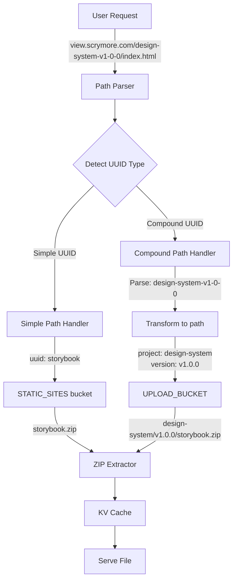

# Option 1: Extended Path Resolution - Implementation Plan

**Selected Approach:** Extended Path Resolution  
**Estimated Effort:** ~1 day (6-8 hours)  
**Status:** Ready for Implementation

---

## Overview

This plan implements support for both URL patterns in the View Service:
- **Legacy:** `view.scrymore.com/{uuid}/` → `scry-static-sites/{uuid}.zip`
- **Extended:** `view.scrymore.com/{project}-{version}/` → `my-storybooks-production/{project}/{version}/storybook.zip`

---

## Architecture Diagram



---

## Implementation Phases

### Phase 1: Configuration (30 minutes)

#### 1.1 Update `cloudflare/wrangler.toml`

Add second R2 bucket binding:

```toml
# Existing binding
[[r2_buckets]]
binding = "STATIC_SITES"
bucket_name = "scry-static-sites"
preview_bucket_name = "scry-static-sites-preview"

# NEW: Add upload bucket binding
[[r2_buckets]]
binding = "UPLOAD_BUCKET"
bucket_name = "my-storybooks-production"
preview_bucket_name = "my-storybooks-staging"
```

#### 1.2 Update `src/types/env.ts`

Add new binding type:

```typescript
export interface Env {
  // Existing
  STATIC_SITES?: R2Bucket;
  CDN_CACHE?: KVNamespace;
  
  // NEW: Add upload bucket
  UPLOAD_BUCKET?: R2Bucket;
  
  // ... rest of existing types
}

export interface CloudflareEnv extends Env {
  STATIC_SITES: R2Bucket;
  UPLOAD_BUCKET: R2Bucket;  // NEW
  CDN_CACHE: KVNamespace;
  PLATFORM: 'cloudflare';
}
```

---

### Phase 2: Path Resolution Logic (2 hours)

#### 2.1 Create `src/utils/path-resolver.ts`

New utility file for path resolution:

```typescript
/**
 * Path resolution utilities for handling both simple and compound UUIDs
 */

export interface SimpleUUID {
  type: 'simple';
  uuid: string;
  zipKey: string;
  bucket: 'STATIC_SITES';
}

export interface CompoundUUID {
  type: 'compound';
  uuid: string;
  project: string;
  version: string;
  zipKey: string;
  bucket: 'UPLOAD_BUCKET';
}

export type UUIDResolution = SimpleUUID | CompoundUUID;

/**
 * Detect if a UUID follows the compound pattern: {project}-{version}
 * 
 * Examples:
 *   - "design-system-v1-0-0" → compound
 *   - "my-app-v2-1-5" → compound  
 *   - "storybook" → simple
 *   - "abc-123" → simple (less than 3 parts)
 */
export function detectUUIDType(uuid: string): 'simple' | 'compound' {
  // Compound pattern must have at least 3 parts when split by '-'
  // Format: {project}-{version} where version often has dashes
  // Examples: design-system-v1-0-0, my-app-v2-1-5
  
  const parts = uuid.split('-');
  
  // If 3+ parts and contains version-like pattern, it's compound
  // Version pattern: starts with 'v' followed by numbers/dots converted to dashes
  if (parts.length >= 3) {
    // Check if any part looks like a version (v1, v2, etc.)
    const hasVersionPart = parts.some(part => /^v\d+$/.test(part));
    if (hasVersionPart) {
      return 'compound';
    }
  }
  
  return 'simple';
}

/**
 * Convert compound UUID to storage path
 * 
 * Input: "design-system-v1-0-0"
 * Output: { project: "design-system", version: "v1.0.0" }
 */
export function parseCompoundUUID(uuid: string): { project: string; version: string } | null {
  const parts = uuid.split('-');
  
  // Find where version starts (first part starting with 'v' followed by digit)
  const versionStartIndex = parts.findIndex(part => /^v\d+$/.test(part));
  
  if (versionStartIndex === -1 || versionStartIndex === 0) {
    return null; // Invalid format
  }
  
  // Everything before version = project
  const project = parts.slice(0, versionStartIndex).join('-');
  
  // Everything from version onward, convert dashes to dots
  const versionParts = parts.slice(versionStartIndex);
  const version = versionParts.join('.').replace(/-/g, '.');
  
  return { project, version };
}

/**
 * Resolve UUID to storage path
 */
export function resolveUUID(uuid: string): UUIDResolution | null {
  const type = detectUUIDType(uuid);
  
  if (type === 'simple') {
    return {
      type: 'simple',
      uuid,
      zipKey: `${uuid}.zip`,
      bucket: 'STATIC_SITES'
    };
  }
  
  // Compound UUID
  const parsed = parseCompoundUUID(uuid);
  if (!parsed) {
    return null; // Invalid compound format
  }
  
  return {
    type: 'compound',
    uuid,
    project: parsed.project,
    version: parsed.version,
    zipKey: `${parsed.project}/${parsed.version}/storybook.zip`,
    bucket: 'UPLOAD_BUCKET'
  };
}

/**
 * Convert version string to URL-safe format
 * "v1.0.0" → "v1-0-0"
 */
export function versionToSlug(version: string): string {
  return version.replace(/\./g, '-');
}

/**
 * Convert URL slug to version format
 * "v1-0-0" → "v1.0.0"
 */
export function slugToVersion(slug: string): string {
  // Only convert numeric segments after 'v'
  return slug.replace(/^(v\d+)-(\d+)-(\d+)/, '$1.$2.$3');
}
```

#### 2.2 Update `src/utils/subdomain.ts`

Enhance existing function to use new resolution logic:

```typescript
import { resolveUUID, type UUIDResolution } from './path-resolver';

export interface PathInfo {
  isValid: boolean;
  uuid: string;
  filePath: string;
  resolution?: UUIDResolution; // NEW: Add resolution info
}

export function parsePathForUUID(pathname: string): PathInfo | null {
  // Remove leading/trailing slashes
  const cleanPath = pathname.replace(/^\/+|\/+$/g, '');
  
  if (!cleanPath) {
    return null;
  }
  
  // Split into segments
  const segments = cleanPath.split('/');
  
  // First segment is UUID
  const uuid = segments[0];
  
  // Validate UUID format (alphanumeric + hyphens, min 3 chars)
  if (!/^[a-zA-Z0-9-]{3,}$/.test(uuid)) {
    return {
      isValid: false,
      uuid: '',
      filePath: ''
    };
  }
  
  // Rest is file path
  const filePath = segments.slice(1).join('/');
  
  // NEW: Resolve UUID to storage path
  const resolution = resolveUUID(uuid);
  
  return {
    isValid: resolution !== null,
    uuid,
    filePath,
    resolution: resolution || undefined
  };
}
```

---

### Phase 3: Route Handler Updates (2 hours)

#### 3.1 Update `src/routes/zip-static.ts`

Modify to support both buckets:

```typescript
import { Hono } from 'hono';
import { parsePathForUUID } from '@/utils/subdomain';
import { getMimeType } from '@/utils/mime-types';
import { getCentralDirectory } from '@/services/zip/central-directory';
import { extractFile } from '@/services/zip/extractor';
import { normalizePath, isPathSafe, getCacheControl } from '@/utils/zip-utils';
import type { Env } from '@/types/env';

export const zipStaticRoutes = new Hono<{ Bindings: Env }>();

zipStaticRoutes.get('/*', async (c) => {
  const url = new URL(c.req.url);
  const cache = c.env.CDN_CACHE! as any;

  // Parse path and resolve UUID
  const pathInfo = parsePathForUUID(url.pathname);

  if (!pathInfo || !pathInfo.isValid || !pathInfo.resolution) {
    return c.text('Invalid format. Expected: view.domain.com/{uuid}/path', 400);
  }

  const { uuid, filePath, resolution } = pathInfo;

  // NEW: Select bucket based on resolution type
  const storage = resolution.bucket === 'UPLOAD_BUCKET'
    ? c.env.UPLOAD_BUCKET! as any
    : c.env.STATIC_SITES! as any;

  // Use resolved ZIP key
  const zipKey = resolution.zipKey;

  // Normalize requested file path
  const cleanPath = normalizePath('/' + filePath);

  if (!isPathSafe(cleanPath)) {
    return c.text('Invalid path', 400);
  }

  try {
    // Get central directory (cached in KV)
    const centralDir = await getCentralDirectory(storage, cache, zipKey);

    // Find the requested file
    let fileEntry = centralDir.entries[cleanPath];

    if (!fileEntry) {
      // Try index.html for SPA routing
      if (!cleanPath.includes('.')) {
        const indexEntry = centralDir.entries['index.html'];

        if (indexEntry) {
          const data = await extractFile(storage, zipKey, indexEntry);
          return new Response(data, {
            headers: {
              'Content-Type': 'text/html',
              'Cache-Control': getCacheControl('index.html'),
              'Access-Control-Allow-Origin': c.env.ALLOWED_ORIGINS || '*'
            }
          });
        }
      }

      return c.text('Not Found', 404);
    }

    // Extract file using range request
    const fileData = await extractFile(storage, zipKey, fileEntry);

    // Determine content type
    const contentType = getMimeType(cleanPath);

    // Build response headers
    const headers: Record<string, string> = {
      'Content-Type': contentType,
      'Cache-Control': getCacheControl(cleanPath),
      'Access-Control-Allow-Origin': c.env.ALLOWED_ORIGINS || '*',
      'Content-Length': fileEntry.size.toString(),
      'ETag': `"${fileEntry.crc32}"`
    };

    return new Response(fileData, { headers });
  } catch (error) {
    console.error('Error serving file from ZIP:', error);
    console.error('Bucket:', resolution.bucket, 'Key:', zipKey);
    return c.text('Internal Server Error', 500);
  }
});
```

---

### Phase 4: Testing (2 hours)

#### 4.1 Create `tests/utils/path-resolver.test.ts`

```typescript
import { describe, it, expect } from 'vitest';
import {
  detectUUIDType,
  parseCompoundUUID,
  resolveUUID,
  versionToSlug,
  slugToVersion
} from '@/utils/path-resolver';

describe('path-resolver', () => {
  describe('detectUUIDType', () => {
    it('detects simple UUIDs', () => {
      expect(detectUUIDType('storybook')).toBe('simple');
      expect(detectUUIDType('my-app')).toBe('simple');
      expect(detectUUIDType('abc-123')).toBe('simple');
    });

    it('detects compound UUIDs', () => {
      expect(detectUUIDType('design-system-v1-0-0')).toBe('compound');
      expect(detectUUIDType('my-app-v2-1-5')).toBe('compound');
      expect(detectUUIDType('project-v1-0-0-beta')).toBe('compound');
    });
  });

  describe('parseCompoundUUID', () => {
    it('parses valid compound UUIDs', () => {
      expect(parseCompoundUUID('design-system-v1-0-0')).toEqual({
        project: 'design-system',
        version: 'v1.0.0'
      });

      expect(parseCompoundUUID('my-app-v2-1-5')).toEqual({
        project: 'my-app',
        version: 'v2.1.5'
      });
    });

    it('returns null for invalid formats', () => {
      expect(parseCompoundUUID('invalid')).toBeNull();
      expect(parseCompoundUUID('v1-0-0')).toBeNull();
    });
  });

  describe('resolveUUID', () => {
    it('resolves simple UUIDs', () => {
      const result = resolveUUID('storybook');
      expect(result).toEqual({
        type: 'simple',
        uuid: 'storybook',
        zipKey: 'storybook.zip',
        bucket: 'STATIC_SITES'
      });
    });

    it('resolves compound UUIDs', () => {
      const result = resolveUUID('design-system-v1-0-0');
      expect(result).toEqual({
        type: 'compound',
        uuid: 'design-system-v1-0-0',
        project: 'design-system',
        version: 'v1.0.0',
        zipKey: 'design-system/v1.0.0/storybook.zip',
        bucket: 'UPLOAD_BUCKET'
      });
    });
  });

  describe('version conversion', () => {
    it('converts version to slug', () => {
      expect(versionToSlug('v1.0.0')).toBe('v1-0-0');
      expect(versionToSlug('v2.1.5')).toBe('v2-1-5');
    });

    it('converts slug to version', () => {
      expect(slugToVersion('v1-0-0')).toBe('v1.0.0');
      expect(slugToVersion('v2-1-5')).toBe('v2.1.5');
    });
  });
});
```

#### 4.2 Manual Testing Script

Create `scripts/test-integration.sh`:

```bash
#!/bin/bash

# Test script for upload service integration

echo "Testing View Service Integration..."

# Test 1: Legacy simple UUID
echo "\n1. Testing legacy pattern (simple UUID)..."
curl -I http://localhost:8788/storybook/

# Test 2: Compound UUID
echo "\n2. Testing compound UUID pattern..."
curl -I http://localhost:8788/design-system-v1-0-0/

# Test 3: File access
echo "\n3. Testing file access in compound UUID..."
curl -I http://localhost:8788/design-system-v1-0-0/index.html

# Test 4: Asset access
echo "\n4. Testing asset access..."
curl -I http://localhost:8788/design-system-v1-0-0/assets/style.css

echo "\nDone!"
```

---

### Phase 5: Documentation Updates (1 hour)

#### 5.1 Update `docs/UPLOAD_SERVICE_INTEGRATION.md`

Add new section:

```markdown
## View Service Integration

### Automatic URL Generation

When you upload a Storybook via the Upload Service, it becomes automatically viewable through the View Service using this URL pattern:

```
https://view.scrymore.com/{project}-{version}/
```

**Examples:**

Upload to: `my-storybooks-production/design-system/v1.0.0/storybook.zip`
View at: `https://view.scrymore.com/design-system-v1-0-0/`

Upload to: `my-storybooks-production/my-app/v2.1.5/storybook.zip`
View at: `https://view.scrymore.com/my-app-v2-1-5/`

### URL Format Rules

1. **Project name** stays as-is (hyphens allowed)
2. **Version dots** convert to hyphens: `v1.0.0` → `v1-0-0`
3. **Pattern:** `{project}-{version}` where version starts with 'v'

### After Upload Response

The Upload Service should provide the View URL in its response:

```json
{
  "success": true,
  "data": {
    "buildId": "abc123",
    "buildNumber": 5,
    "zipUrl": "https://pub-my-storybooks-production.../design-system/v1.0.0/storybook.zip",
    "viewUrl": "https://view.scrymore.com/design-system-v1-0-0/"
  }
}
```
```

---

## Implementation Checklist

- [ ] **Phase 1: Configuration**
  - [ ] Add `UPLOAD_BUCKET` binding to `cloudflare/wrangler.toml`
  - [ ] Update `src/types/env.ts` with new binding

- [ ] **Phase 2: Path Resolution**
  - [ ] Create `src/utils/path-resolver.ts` with all resolution functions
  - [ ] Update `src/utils/subdomain.ts` to use resolution

- [ ] **Phase 3: Route Handler**
  - [ ] Update `src/routes/zip-static.ts` for bucket selection
  - [ ] Add error handling for both bucket types

- [ ] **Phase 4: Testing**
  - [ ] Write unit tests in `tests/utils/path-resolver.test.ts`
  - [ ] Create `scripts/test-integration.sh` test script
  - [ ] Test locally with `npm run dev:cloudflare`
  - [ ] Verify both simple and compound UUIDs work

- [ ] **Phase 5: Documentation**
  - [ ] Update `docs/UPLOAD_SERVICE_INTEGRATION.md`
  - [ ] Add URL examples and format rules
  - [ ] Document for Upload Service team

---

## Testing Strategy

### Local Testing

1. **Start local dev server:**
   ```bash
   npm run dev:cloudflare
   ```

2. **Create test data in upload bucket:**
   ```bash
   # Upload test Storybook to staging bucket
   npx wrangler r2 object put my-storybooks-staging/design-system/v1.0.0/storybook.zip \
     --file=storybook-static.zip
   ```

3. **Test compound UUID:**
   ```bash
   curl http://localhost:8788/design-system-v1-0-0/
   ```

4. **Test legacy UUID:**
   ```bash
   curl http://localhost:8788/storybook/
   ```

### Production Testing

1. Deploy to development environment
2. Upload via Upload Service staging endpoint
3. Verify View Service automatically serves the content
4. Test multiple projects and versions

---

## Rollback Plan

If issues arise:

1. **Quick rollback:** Comment out compound UUID detection in `path-resolver.ts`:
   ```typescript
   export function detectUUIDType(uuid: string): 'simple' | 'compound' {
     return 'simple'; // Force all to simple until fixed
   }
   ```

2. **Full rollback:** Revert changes to `zip-static.ts` to always use `STATIC_SITES`

3. **Bucket isolation:** Both buckets remain independent, no data corruption risk

---

## Performance Considerations

### Cache Strategy

- Central directory cached in KV for 24 hours (unchanged)
- Bucket selection adds ~0ms (compile-time decision)
- No performance degradation for either path type

### Memory Usage

- No additional memory required
- Both buckets use same extraction logic
- KV cache shared across both patterns

### Scalability

- Each bucket scales independently
- No cross-bucket dependencies
- Can easily add more patterns in future

---

## Future Enhancements

After Option 1 is stable, consider:

1. **Add Firestore integration** for richer metadata
2. **Custom URL aliases** via KV mapping
3. **Version ranges** (e.g., `design-system-latest`)
4. **Build number URLs** (e.g., `design-system-build-5`)

---

## Next Steps

1. ✅ Review this implementation plan
2. ⏭️ Switch to **Code mode** to implement
3. 🧪 Test thoroughly in development
4. 🚀 Deploy to production
5. 📝 Update Upload Service to return view URLs

**Ready to implement? Switch to Code mode to begin!**