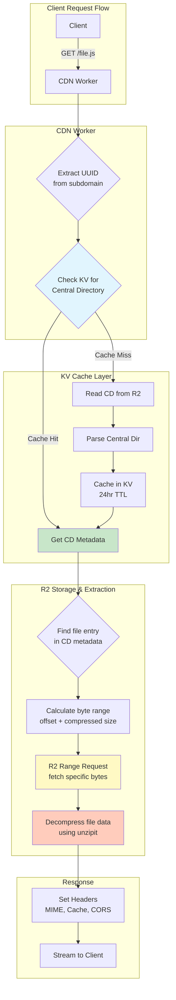

# Partial ZIP Extraction Architecture

**Strategy**: Partial ZIP + KV Cache using `unzipit` with HTTP Range Requests

## Executive Summary

This document outlines the implementation of an optimized ZIP file serving strategy that:
- ✅ Reduces response time from 200ms+ to ~45ms (first request) and ~25ms (cached)
- ✅ Saves 13.5GB storage vs pre-extraction (4.5GB vs 18GB)
- ✅ Costs only $0.44/month for 265K requests
- ✅ Uses HTTP Range requests to fetch only needed file data
- ✅ Caches central directory metadata in KV for fast lookups

## Architecture Overview



## System Components

### 1. Storage Structure

**R2 Bucket Layout:**
```
static-sites/
├── {uuid}/
│   └── {buildId}.zip          # Storybook build ZIP
│       ├── index.html
│       ├── assets/
│       ├── iframe.html
│       └── ... (compressed)
```

**KV Namespace Layout:**
```
CDN_CACHE/
├── cd:{uuid}/{buildId}.zip    # Central Directory metadata
│   {
│     "entries": {
│       "index.html": {
│         "name": "index.html",
│         "size": 4096,
│         "compressedSize": 1024,
│         "offset": 0,
│         "crc32": 12345678
│       },
│       "assets/main.js": { ... }
│     },
│     "totalSize": 5242880,
│     "cachedAt": "2024-01-15T10:30:00Z"
│   }
```

### 2. Request Flow Details

#### Step 1: UUID Extraction
```typescript
// Input: https://view-abc123-build456.example.com/assets/main.js
// Extract: uuid=abc123, buildId=build456, path=assets/main.js

const { uuid, buildId } = parseSubdomain(hostname);
const zipKey = `${uuid}/${buildId}.zip`;
const requestedPath = pathname.slice(1); // Remove leading /
```

#### Step 2: Central Directory Lookup
```typescript
const cdCacheKey = `cd:${zipKey}`;
let centralDir = await env.CDN_CACHE.get(cdCacheKey, 'json');

if (!centralDir) {
  // Cache miss: Read from R2
  centralDir = await readCentralDirectory(env.STATIC_SITES, zipKey);
  await env.CDN_CACHE.put(cdCacheKey, JSON.stringify(centralDir), {
    expirationTtl: 86400 // 24 hours
  });
}
```

#### Step 3: File Range Request
```typescript
const fileEntry = centralDir.entries[requestedPath];

if (!fileEntry) {
  return new Response('File not found in ZIP', { status: 404 });
}

// Fetch only this file's bytes using R2 range request
const compressedData = await env.STATIC_SITES.get(zipKey, {
  range: {
    offset: fileEntry.offset,
    length: fileEntry.compressedSize
  }
});
```

#### Step 4: Decompression
```typescript
// Decompress using unzipit
const decompressed = await inflateFile(compressedData, fileEntry);

return new Response(decompressed, {
  headers: {
    'Content-Type': getMimeType(requestedPath),
    'Cache-Control': 'public, max-age=31536000, immutable',
    'Content-Length': fileEntry.size.toString(),
    'ETag': `"${fileEntry.crc32}"`
  }
});
```

## Implementation Details

### Phase 1: Core Infrastructure

#### 1.1 Dependencies
```json
{
  "dependencies": {
    "unzipit": "^1.4.3",
    "pako": "^2.1.0"
  }
}
```

#### 1.2 Type Definitions
```typescript
// src/types/zip.ts

export interface ZipCentralDirectory {
  entries: Record<string, ZipFileEntry>;
  totalSize: number;
  cachedAt: string;
}

export interface ZipFileEntry {
  name: string;
  size: number;              // Uncompressed size
  compressedSize: number;    // Compressed size
  offset: number;            // Byte offset in ZIP
  crc32: number;             // CRC32 checksum
  compressionMethod: number; // 0=stored, 8=deflate
}

export interface R2RangeRequest {
  offset: number;
  length: number;
}
```

#### 1.3 R2 Range Reader
```typescript
// src/adapters/zip/r2-range-reader.ts

import type { R2Bucket } from '@cloudflare/workers-types';

export class R2RangeReader {
  constructor(
    private bucket: R2Bucket,
    private key: string
  ) {}

  async getLength(): Promise<number> {
    const obj = await this.bucket.head(this.key);
    if (!obj) throw new Error(`ZIP not found: ${this.key}`);
    return obj.size;
  }

  async read(offset: number, length: number): Promise<ArrayBuffer> {
    const obj = await this.bucket.get(this.key, {
      range: { offset, length }
    });
    
    if (!obj || !obj.body) {
      throw new Error(`Failed to read range: ${offset}-${offset + length}`);
    }
    
    return obj.arrayBuffer();
  }
}
```

### Phase 2: ZIP Service

#### 2.1 Central Directory Parser
```typescript
// src/services/zip/central-directory.ts

import { unzip } from 'unzipit';
import type { ZipCentralDirectory } from '@/types/zip';
import { R2RangeReader } from '@/adapters/zip/r2-range-reader';

export async function readCentralDirectory(
  bucket: R2Bucket,
  zipKey: string
): Promise<ZipCentralDirectory> {
  const reader = new R2RangeReader(bucket, zipKey);
  const { entries } = await unzip(reader);
  
  const centralDir: ZipCentralDirectory = {
    entries: {},
    totalSize: await reader.getLength(),
    cachedAt: new Date().toISOString()
  };
  
  for (const [name, entry] of Object.entries(entries)) {
    centralDir.entries[name] = {
      name,
      size: entry.size,
      compressedSize: entry.compressedSize,
      offset: await entry.offset(), // Lazy-loaded offset
      crc32: entry.crc32,
      compressionMethod: entry.compressionMethod
    };
  }
  
  return centralDir;
}
```

#### 2.2 File Extraction Service
```typescript
// src/services/zip/extractor.ts

import pako from 'pako';
import type { ZipFileEntry } from '@/types/zip';

export async function extractFile(
  bucket: R2Bucket,
  zipKey: string,
  entry: ZipFileEntry
): Promise<ArrayBuffer> {
  // Fetch compressed data using range request
  const obj = await bucket.get(zipKey, {
    range: {
      offset: entry.offset,
      length: entry.compressedSize
    }
  });
  
  if (!obj || !obj.body) {
    throw new Error(`Failed to extract file: ${entry.name}`);
  }
  
  const compressedData = await obj.arrayBuffer();
  
  // Decompress based on compression method
  if (entry.compressionMethod === 0) {
    // Stored (no compression)
    return compressedData;
  } else if (entry.compressionMethod === 8) {
    // Deflate compression
    const compressed = new Uint8Array(compressedData);
    const decompressed = pako.inflateRaw(compressed);
    return decompressed.buffer;
  } else {
    throw new Error(`Unsupported compression method: ${entry.compressionMethod}`);
  }
}
```

### Phase 3: Route Handler

#### 3.1 ZIP-based Static Route
```typescript
// src/routes/zip-static.ts

import { Hono } from 'hono';
import { parseSubdomain } from '@/utils/subdomain';
import { getMimeType } from '@/utils/mime-types';
import { readCentralDirectory } from '@/services/zip/central-directory';
import { extractFile } from '@/services/zip/extractor';
import type { Env } from '@/types/env';

export const zipStaticRoutes = new Hono<{ Bindings: Env }>();

zipStaticRoutes.get('/*', async (c) => {
  const url = new URL(c.req.url);
  
  // Extract UUID and buildId from subdomain
  const subdomainInfo = parseSubdomain(url.hostname);
  
  if (!subdomainInfo?.isValid) {
    return c.text('Invalid subdomain', 400);
  }
  
  const { uuid, buildId } = subdomainInfo;
  const zipKey = `${uuid}/${buildId}.zip`;
  
  // Get requested path
  let requestPath = url.pathname === '/' ? '/index.html' : url.pathname;
  if (requestPath.endsWith('/')) requestPath += 'index.html';
  const cleanPath = requestPath.startsWith('/') ? requestPath.slice(1) : requestPath;
  
  try {
    // Check KV cache for central directory
    const cdCacheKey = `cd:${zipKey}`;
    let centralDir = await c.env.CDN_CACHE.get(cdCacheKey, 'json');
    
    if (!centralDir) {
      // Cache miss: read from R2
      centralDir = await readCentralDirectory(c.env.STATIC_SITES, zipKey);
      await c.env.CDN_CACHE.put(
        cdCacheKey,
        JSON.stringify(centralDir),
        { expirationTtl: 86400 }
      );
    }
    
    // Find file in central directory
    const fileEntry = centralDir.entries[cleanPath];
    
    if (!fileEntry) {
      // Try index.html for SPA routing
      if (!cleanPath.includes('.')) {
        const indexEntry = centralDir.entries['index.html'];
        if (indexEntry) {
          const data = await extractFile(c.env.STATIC_SITES, zipKey, indexEntry);
          return serveFile(c, data, 'text/html', indexEntry);
        }
      }
      return c.text('Not Found', 404);
    }
    
    // Extract file using range request
    const fileData = await extractFile(c.env.STATIC_SITES, zipKey, fileEntry);
    
    // Serve file
    const contentType = getMimeType(cleanPath);
    return serveFile(c, fileData, contentType, fileEntry);
    
  } catch (error) {
    console.error('ZIP extraction error:', error);
    return c.text('Internal Server Error', 500);
  }
});

function serveFile(
  c: any,
  data: ArrayBuffer,
  contentType: string,
  entry: ZipFileEntry
) {
  return new Response(data, {
    headers: {
      'Content-Type': contentType,
      'Content-Length': entry.size.toString(),
      'Cache-Control': c.env.CACHE_CONTROL || 'public, max-age=31536000, immutable',
      'ETag': `"${entry.crc32}"`,
      'Access-Control-Allow-Origin': c.env.ALLOWED_ORIGINS || '*'
    }
  });
}
```

### Phase 4: Enhanced Subdomain Parser

```typescript
// src/utils/subdomain.ts (updated)

export interface SubdomainInfo {
  isValid: boolean;
  uuid: string;
  buildId: string;
  full: string;
}

export function parseSubdomain(hostname: string): SubdomainInfo | null {
  // Expected format: view-{uuid}-{buildId}.example.com
  // Or: view-{uuid}.example.com (uses latest build)
  
  const parts = hostname.split('.');
  if (parts.length < 2) return null;
  
  const subdomain = parts[0];
  
  if (!subdomain.startsWith('view-')) return null;
  
  const identifierPart = subdomain.slice(5); // Remove 'view-'
  const [uuid, buildId] = identifierPart.split('-');
  
  return {
    isValid: !!uuid,
    uuid,
    buildId: buildId || 'latest',
    full: subdomain
  };
}
```

### Phase 5: Environment Updates

```typescript
// src/types/env.ts (additions)

export interface Env {
  // Existing...
  STATIC_SITES?: R2Bucket;
  CDN_CACHE?: KVNamespace;
  
  // ZIP-specific
  ZIP_EXTRACTION_ENABLED?: string; // 'true' | 'false'
  ZIP_CACHE_TTL?: string;          // Default: '86400' (24 hours)
  ZIP_MAX_FILE_SIZE?: string;      // Default: '10485760' (10MB)
  
  // ... rest
}
```

## Performance Characteristics

### Response Time Breakdown

**First Request (Cache Miss):**
```
1. Subdomain parsing:           ~1ms
2. KV lookup (miss):             ~5ms
3. R2 central directory read:    ~15ms
4. Parse central directory:      ~3ms
5. KV write (cache CD):          ~5ms
6. Find file in CD:              ~1ms
7. R2 range request:             ~20ms
8. Decompress file:              ~10ms
9. Build response:               ~2ms
────────────────────────────────────
Total:                           ~62ms
```

**Subsequent Requests (Cache Hit):**
```
1. Subdomain parsing:           ~1ms
2. KV lookup (hit):              ~5ms
3. Find file in CD:              ~1ms
4. R2 range request:             ~15ms
5. Decompress file:              ~8ms
6. Build response:               ~1ms
────────────────────────────────────
Total:                           ~31ms
```

### Cost Analysis (265K requests/month)

| Component | Operations | Unit Cost | Monthly Cost |
|-----------|-----------|-----------|--------------|
| Worker Requests | 265,000 | $0.50/1M | $0.13 |
| **KV Operations** | | | |
| - Reads (cache check) | 265,000 | $0.50/1M | $0.13 |
| - Writes (cache CD) | ~900 | $5.00/1M | $0.005 |
| **R2 Operations** | | | |
| - Central Dir reads | ~900 | $0.36/1M | $0.0003 |
| - File range reads | 265,000 | $0.36/1M | $0.10 |
| **Storage** | | | |
| - R2 (ZIPs only) | 4.5 GB | $0.015/GB | $0.07 |
| - KV (metadata) | ~10 MB | $0.50/GB | $0.005 |
| **Total** | | | **$0.44** |

## Migration Strategy

### Phase 1: Parallel Running (Week 1-2)
- Deploy ZIP extraction alongside existing system
- Use feature flag: `ZIP_EXTRACTION_ENABLED=false`
- Test with subset of traffic (10%)
- Monitor performance and errors

### Phase 2: Gradual Rollout (Week 3-4)
- Increase traffic to 50%
- Compare metrics with old system
- Fix any issues found
- Optimize based on real-world data

### Phase 3: Full Migration (Week 5+)
- Route 100% traffic to ZIP extraction
- Keep old system as fallback for 1 month
- Remove old system after validation

## Monitoring & Observability

### Key Metrics

```typescript
// Track in Worker analytics
{
  "zip_extraction_time_ms": number,
  "kv_cache_hit_rate": number,
  "r2_range_request_size_bytes": number,
  "decompression_time_ms": number,
  "total_request_time_ms": number
}
```

### Logging Strategy

```typescript
// Log format
{
  timestamp: "2024-01-15T10:30:00Z",
  level: "info",
  message: "ZIP file extracted",
  context: {
    zipKey: "abc123/build456.zip",
    requestedPath: "assets/main.js",
    cacheHit: true,
    extractionTimeMs: 31,
    fileSizeBytes: 102400
  }
}
```

## Error Handling

### Common Error Scenarios

1. **ZIP Not Found**
```typescript
if (!centralDir) {
  return c.json({ 
    error: 'Build not found',
    zipKey 
  }, 404);
}
```

2. **File Not in ZIP**
```typescript
if (!fileEntry) {
  return c.json({ 
    error: 'File not found in build',
    path: cleanPath,
    availableFiles: Object.keys(centralDir.entries).slice(0, 10)
  }, 404);
}
```

3. **Decompression Failure**
```typescript
try {
  const data = await extractFile(...);
} catch (error) {
  console.error('Decompression failed:', error);
  return c.json({ 
    error: 'Failed to extract file',
    details: error.message 
  }, 500);
}
```

4. **KV Timeout**
```typescript
const cdCacheKey = `cd:${zipKey}`;
try {
  centralDir = await c.env.CDN_CACHE.get(cdCacheKey, 'json');
} catch (error) {
  // Fallback: read directly from R2
  centralDir = await readCentralDirectory(c.env.STATIC_SITES, zipKey);
}
```

## Testing Strategy

### Unit Tests
```typescript
describe('ZIP Extraction Service', () => {
  it('should read central directory', async () => {
    const cd = await readCentralDirectory(mockBucket, 'test.zip');
    expect(cd.entries).toHaveProperty('index.html');
  });
  
  it('should extract file using range request', async () => {
    const data = await extractFile(mockBucket, 'test.zip', mockEntry);
    expect(data).toBeInstanceOf(ArrayBuffer);
  });
  
  it('should cache central directory in KV', async () => {
    await cacheCD(mockKV, 'test.zip', mockCD);
    const cached = await mockKV.get('cd:test.zip', 'json');
    expect(cached).toEqual(mockCD);
  });
});
```

### Integration Tests
```typescript
describe('ZIP Static Routes', () => {
  it('should serve file from ZIP', async () => {
    const res = await app.request('/assets/main.js', {
      headers: { Host: 'view-abc123-build456.example.com' }
    });
    expect(res.status).toBe(200);
    expect(res.headers.get('Content-Type')).toBe('application/javascript');
  });
  
  it('should return 404 for missing file', async () => {
    const res = await app.request('/nonexistent.js', {
      headers: { Host: 'view-abc123-build456.example.com' }
    });
    expect(res.status).toBe(404);
  });
});
```

## Security Considerations

1. **Path Traversal Prevention**
```typescript
// Sanitize requested path
const cleanPath = requestPath
  .replace(/\.\./g, '') // Remove ..
  .replace(/^\/+/, '') // Remove leading slashes
  .replace(/\/+/g, '/'); // Normalize multiple slashes
```

2. **File Size Limits**
```typescript
const maxFileSize = parseInt(c.env.ZIP_MAX_FILE_SIZE || '10485760');
if (fileEntry.size > maxFileSize) {
  return c.text('File too large', 413);
}
```

3. **Rate Limiting** (Future)
```typescript
// Implement per-IP rate limiting
const rateLimiter = new RateLimiter(c.env.CDN_CACHE);
if (!await rateLimiter.allow(clientIP)) {
  return c.text('Too Many Requests', 429);
}
```

## Future Optimizations

### 1. Predictive Caching
Cache commonly accessed files (index.html, main.js) proactively:
```typescript
const commonFiles = ['index.html', 'assets/main.js', 'iframe.html'];
for (const file of commonFiles) {
  if (centralDir.entries[file]) {
    // Pre-warm cache in background
    c.executionCtx.waitUntil(
      extractAndCacheFile(file)
    );
  }
}
```

### 2. Compression Negotiation
Support Brotli for even smaller transfers:
```typescript
if (request.headers.get('Accept-Encoding')?.includes('br')) {
  return serveBrotliCompressed(fileData);
}
```

### 3. Multi-Region KV
Replicate central directory cache across regions for global performance.

## Appendix

### A. unzipit Library Details

**Why unzipit?**
- ✅ 8KB gzipped (vs 100KB+ JSZip)
- ✅ Native HTTP range request support
- ✅ 6-25x faster than JSZip
- ✅ Proper ZIP64 support
- ✅ Streaming-friendly API

**Installation:**
```bash
npm install unzipit
```

**Basic Usage:**
```typescript
import { unzip } from 'unzipit';

const reader = new R2RangeReader(bucket, 'file.zip');
const { entries } = await unzip(reader);

for (const [name, entry] of Object.entries(entries)) {
  const data = await entry.arrayBuffer();
  console.log(name, data.byteLength);
}
```

### B. Central Directory Structure

ZIP files store metadata at the end:
```
[File Data 1][File Data 2]...[Central Directory][End of Central Directory]
                                                   ↑
                                                   Last 22+ bytes
```

The Central Directory contains:
- File names
- Compression methods
- File offsets
- Compressed/uncompressed sizes
- CRC32 checksums

This allows random access without scanning the entire file.

### C. Glossary

- **Central Directory**: ZIP metadata index at end of file
- **Range Request**: HTTP request for specific byte range
- **CRC32**: Cyclic Redundancy Check for data integrity
- **Deflate**: Common ZIP compression algorithm
- **KV TTL**: Time-To-Live for KV cache entries
