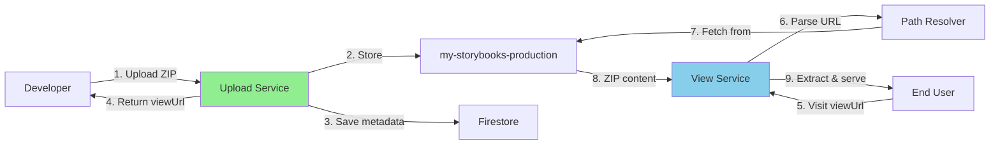

# Service Responsibilities - Upload Service Integration

This document clarifies which changes belong to which service.

---

## Two Separate Services

### 1. **Upload Service** (External Application)
- **Repository:** Separate codebase (not this repo)
- **Purpose:** Handles Storybook ZIP uploads
- **Storage:** `my-storybooks-production` R2 bucket
- **Metadata:** Firestore database
- **URL:** `https://storybook-deployment-service.epinnock.workers.dev`

### 2. **View Service** (THIS Application - scry-cdn-service)
- **Repository:** Current codebase (`/home/boxuser/scry/scry-cdn-service`)
- **Purpose:** Serves static sites from ZIP files
- **Storage:** Currently `scry-static-sites`, needs to ADD `my-storybooks-production`
- **URL:** `https://view.scrymore.com`

---

## Changes Required by Service

### 🔵 View Service (THIS REPO) - MAJOR CHANGES

**All implementation happens here in the `scry-cdn-service` repository.**

#### Files to Create:
1. **`src/utils/path-resolver.ts`** (NEW)
   - Compound UUID detection
   - Path conversion logic
   - ~200 lines of code

#### Files to Modify:
1. **`cloudflare/wrangler.toml`**
   - Add `UPLOAD_BUCKET` R2 binding
   - ~5 lines added

2. **`src/types/env.ts`**
   - Add `UPLOAD_BUCKET?: R2Bucket` type
   - ~2 lines added

3. **`src/utils/subdomain.ts`**
   - Update `parsePathForUUID()` to use path resolver
   - ~10 lines modified

4. **`src/routes/zip-static.ts`**
   - Add bucket selection logic
   - Update to use resolution info
   - ~20 lines modified

5. **`docs/UPLOAD_SERVICE_INTEGRATION.md`**
   - Add new URL pattern documentation
   - ~30 lines added

#### Files to Create (Testing):
1. **`tests/utils/path-resolver.test.ts`** (NEW)
   - Unit tests for path resolution
   - ~100 lines of tests

2. **`scripts/test-integration.sh`** (NEW)
   - Integration testing script
   - ~20 lines

**Total Effort:** 6-8 hours

---

### 🟢 Upload Service (EXTERNAL REPO) - MINOR CHANGES

**Changes happen in the separate Upload Service repository.**

#### Required Changes:

1. **Add `viewUrl` to upload response** (RECOMMENDED)

   **File:** `src/app.ts` (in Upload Service repo)
   
   ```typescript
   // After successful upload
   const viewUrl = generateViewUrl(project, version);
   
   return c.json({
     success: true,
     message: "Upload successful",
     key: key,
     data: {
       url: uploadResult.url,
       path: uploadResult.path,
       versionId: uploadResult.versionId,
       buildId: build.id,
       buildNumber: build.buildNumber,
       viewUrl: viewUrl  // NEW: Add this field
     }
   });
   
   // Helper function to add
   function generateViewUrl(project: string, version: string): string {
     // Convert version: v1.0.0 → v1-0-0
     const versionSlug = version.replace(/\./g, '-');
     return `https://view.scrymore.com/${project}-${versionSlug}/`;
   }
   ```

   **Total Changes:** ~20 lines of code
   **Effort:** 30 minutes

#### Optional Changes:

1. **Validate ZIP structure** (OPTIONAL)
   - Verify `index.html` exists at ZIP root
   - Already covered in existing documentation

2. **Add metadata field** (OPTIONAL)
   - Store `viewUrl` in Firestore build record
   - ~5 lines in build creation

---

## Integration Flow



---

## Step-by-Step Integration

### Phase 1: View Service Implementation (THIS REPO)

**Who:** Your team (current repository)

**Tasks:**
1. Implement all View Service changes (Phases 1-5 in implementation plan)
2. Test with mock data
3. Deploy to staging
4. Verify both URL patterns work

**Files Changed:** 5 modified, 3 created
**Effort:** 6-8 hours

### Phase 2: Upload Service Enhancement (EXTERNAL REPO)

**Who:** Upload Service team (separate repository)

**Tasks:**
1. Add `generateViewUrl()` helper function
2. Include `viewUrl` in upload response
3. Update API documentation

**Files Changed:** 1-2 modified
**Effort:** 30 minutes

### Phase 3: Testing & Documentation

**Who:** Both teams

**Tasks:**
1. Upload via Upload Service
2. Verify View Service displays it automatically
3. Update integration documentation

**Effort:** 1-2 hours

---

## No Changes Required

### ❌ R2 Buckets
- **No changes needed** to existing buckets
- View Service just needs read access to `my-storybooks-production`
- Buckets remain independent

### ❌ Firestore
- **No changes needed** to Firestore structure
- View Service can optionally read Firestore later
- Not required for Phase 1

### ❌ DNS/URLs
- **No changes needed** to existing URLs
- Both services keep their current domains
- No routing changes required

---

## Deployment Strategy

### View Service (THIS REPO)

```bash
# 1. Deploy to staging
npm run deploy:cloudflare:dev

# 2. Test with staging upload bucket
curl https://view-staging.scrymore.com/design-system-v1-0-0/

# 3. Deploy to production
npm run deploy:cloudflare

# 4. Verify production
curl https://view.scrymore.com/design-system-v1-0-0/
```

### Upload Service (EXTERNAL REPO)

```bash
# 1. Deploy updated response format
# (follows their deployment process)

# 2. Test upload
curl -X POST \
  -H "Content-Type: application/zip" \
  --data-binary @storybook.zip \
  https://storybook-deployment-service.epinnock.workers.dev/upload/design-system/v1.0.0

# 3. Verify viewUrl in response
```

---

## Summary

### View Service (THIS REPOSITORY) ⭐ PRIMARY WORK

**Status:** All work happens here  
**Scope:** Medium implementation (~6-8 hours)  
**Changes:** 5 files modified, 3 files created  
**Impact:** Adds support for Upload Service storage pattern  

### Upload Service (EXTERNAL REPOSITORY) ✨ OPTIONAL ENHANCEMENT

**Status:** Minor enhancement  
**Scope:** Small change (~30 minutes)  
**Changes:** 1 file modified  
**Impact:** Returns convenient viewUrl to users  

---

## Questions?

**Q: Do I need access to the Upload Service repository?**  
A: No, not for Phase 1. All core functionality is in View Service.

**Q: What if Upload Service doesn't add viewUrl?**  
A: Users can manually construct URLs using the pattern: `https://view.scrymore.com/{project}-{version-with-dashes}/`

**Q: Can View Service work without Upload Service changes?**  
A: Yes! View Service is fully functional once implemented. Upload Service enhancement just improves UX.

**Q: Do both services need to deploy simultaneously?**  
A: No. View Service can deploy first and work immediately with existing uploads.

---

**Ready to implement? All work is in THIS repository (`scry-cdn-service`).**