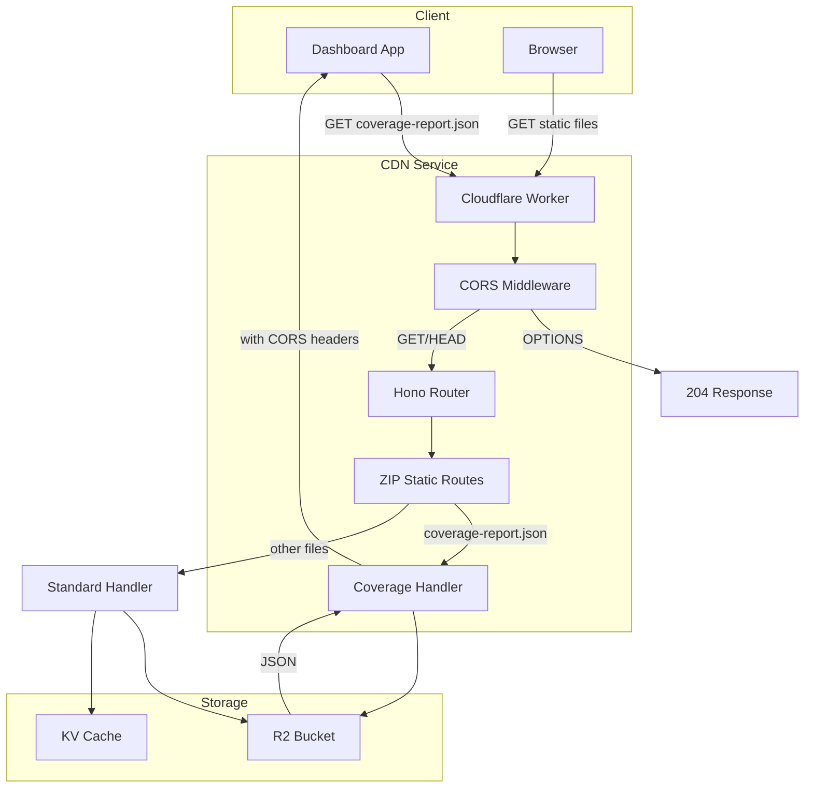
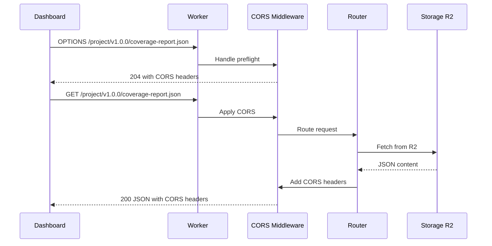

# Implementation Plan: scry-cdn-service Coverage Report Support

## Overview

This plan implements the `04-scry-cdn-service-spec.md` specification to add coverage report JSON serving alongside Storybook builds, with proper CORS configuration and high test coverage.

## Current State Analysis

### Existing CORS Implementation
The current [`src/app.ts`](src/app.ts:16) uses Hono's built-in CORS middleware:

```typescript
app.use('*', cors({
  origin: (origin) => {
    // In production, validate against ALLOWED_ORIGINS
    return origin;
  },
  allowMethods: ['GET', 'HEAD', 'OPTIONS'],
  allowHeaders: ['Content-Type', 'Authorization'],
  maxAge: 86400,
}));
```

**Issues with current implementation:**
1. Returns any origin without validation - security concern
2. No explicit handling for coverage report endpoints
3. No differentiation between public data and restricted endpoints

### Existing Static File Serving
The [`src/routes/zip-static.ts`](src/routes/zip-static.ts:1) handles ZIP-based file serving with:
- Path parsing via [`parsePathForUUID`](src/utils/subdomain.ts:82)
- CORS headers set per-response: `'Access-Control-Allow-Origin': c.env.ALLOWED_ORIGINS || '*'`
- Cache control via [`getCacheControl`](src/utils/zip-utils.ts:42)

### URL Pattern
Coverage reports will be at:
```
https://view.scrymore.com/{projectId}/{versionId}/coverage-report.json
```

This matches the existing path pattern handled by [`parsePathForUUID`](src/utils/subdomain.ts:82).

---

## Implementation Tasks

### 1. Create Enhanced CORS Middleware

**File:** `src/middleware/cors.ts` (NEW)

```typescript
// Allowed origins for dashboard access
const ALLOWED_ORIGINS = [
  'https://dashboard.scrymore.com',
  'https://www.scrymore.com',
  'http://localhost:3000',
  'http://localhost:3001',
];

export interface CorsConfig {
  allowedOrigins?: string[];
  allowAllOrigins?: boolean;
}

export function corsHeaders(request: Request, config?: CorsConfig): Headers;
export function handleOptions(request: Request, config?: CorsConfig): Response;
export function isCoverageReportRequest(pathname: string): boolean;
```

**Key Features:**
- Configurable allowed origins list
- Support for wildcard (`*`) for public data
- Proper preflight (OPTIONS) handling
- Environment-based configuration

### 2. Update Main App CORS Configuration

**File:** `src/app.ts`

Modify to use the new CORS middleware with proper origin validation:

```typescript
import { corsHeaders, handleOptions } from './middleware/cors';

// Handle OPTIONS preflight globally
app.options('*', (c) => {
  return handleOptions(c.req.raw);
});

// Apply CORS headers to all responses
app.use('*', async (c, next) => {
  await next();
  const cors = corsHeaders(c.req.raw);
  cors.forEach((value, key) => {
    c.res.headers.set(key, value);
  });
});
```

### 3. Add Coverage Report Detection and Handling

**File:** `src/routes/zip-static.ts` or `src/routes/coverage.ts` (NEW)

Add specific handling for coverage report requests:

```typescript
function isCoverageReportRequest(pathname: string): boolean {
  return pathname.endsWith('/coverage-report.json');
}
```

**Caching Strategy for Coverage Reports:**
- Coverage reports are immutable once created
- Use aggressive caching: `public, max-age=31536000, immutable`
- Development override: `public, max-age=60`

### 4. Update Cache Control Logic

**File:** `src/utils/zip-utils.ts`

Add coverage report to cache control logic:

```typescript
export function getCacheControl(path: string, isDev?: boolean): string {
  // Coverage reports - immutable
  if (path.endsWith('/coverage-report.json')) {
    return isDev 
      ? 'public, max-age=60' 
      : 'public, max-age=31536000, immutable';
  }
  // ... existing logic
}
```

### 5. Environment Configuration

**File:** `src/types/env.ts`

Add new environment variables:

```typescript
export interface Env {
  // ... existing
  CORS_ALLOWED_ORIGINS?: string;  // Comma-separated list
  CORS_ALLOW_ALL?: string;        // 'true' for public data
}
```

---

## Test Coverage Plan

### Unit Tests

#### 1. CORS Middleware Tests
**File:** `tests/middleware/cors.test.ts` (NEW)

```typescript
describe('CORS Middleware', () => {
  describe('corsHeaders', () => {
    it('should return allowed origin for whitelisted origins');
    it('should return wildcard for non-whitelisted origins when allowAllOrigins is true');
    it('should not return origin header for non-whitelisted origins when allowAllOrigins is false');
    it('should set correct Access-Control-Allow-Methods');
    it('should set correct Access-Control-Allow-Headers');
    it('should set correct Access-Control-Max-Age');
  });

  describe('handleOptions', () => {
    it('should return 204 status for preflight requests');
    it('should include all CORS headers in preflight response');
    it('should handle missing Origin header');
  });

  describe('isCoverageReportRequest', () => {
    it('should return true for coverage-report.json paths');
    it('should return false for other JSON files');
    it('should return false for non-JSON files');
    it('should handle paths with query parameters');
  });
});
```

#### 2. Coverage Report Handling Tests
**File:** `tests/routes/coverage.test.ts` (NEW)

```typescript
describe('Coverage Report Handling', () => {
  describe('isCoverageReportRequest', () => {
    it('should detect /project/v1.0.0/coverage-report.json');
    it('should detect /project/pr-123/coverage-report.json');
    it('should not match /project/v1.0.0/other-report.json');
    it('should not match /project/v1.0.0/coverage-report.html');
  });

  describe('getCacheControl for coverage reports', () => {
    it('should return immutable cache for production');
    it('should return short cache for development');
  });
});
```

#### 3. Updated zip-utils Tests
**File:** `tests/utils/zip-utils.test.ts`

Add tests for coverage report cache control:

```typescript
describe('getCacheControl', () => {
  // ... existing tests
  
  it('should return immutable cache for coverage-report.json', () => {
    expect(getCacheControl('project/v1.0.0/coverage-report.json'))
      .toBe('public, max-age=31536000, immutable');
  });

  it('should return short cache for coverage-report.json in dev mode', () => {
    expect(getCacheControl('project/v1.0.0/coverage-report.json', true))
      .toBe('public, max-age=60');
  });
});
```

### Integration Tests

#### 1. CORS Integration Tests
**File:** `tests/integration/cors.test.ts` (NEW)

```typescript
describe('CORS Integration', () => {
  describe('Preflight Requests', () => {
    it('should handle OPTIONS request for coverage report');
    it('should return correct headers for dashboard origin');
    it('should return correct headers for localhost development');
  });

  describe('Actual Requests', () => {
    it('should include CORS headers in GET response');
    it('should include CORS headers in 404 response');
    it('should include CORS headers in error response');
  });
});
```

#### 2. Coverage Report E2E Tests
**File:** `tests/integration/coverage-report.test.ts` (NEW)

```typescript
describe('Coverage Report E2E', () => {
  it('should serve coverage-report.json with correct Content-Type');
  it('should serve coverage-report.json with CORS headers');
  it('should return 404 for missing coverage report');
  it('should cache coverage reports appropriately');
});
```

---

## File Summary

| File | Action | Description |
|------|--------|-------------|
| `src/middleware/cors.ts` | CREATE | Enhanced CORS middleware with origin validation |
| `src/app.ts` | MODIFY | Update to use new CORS middleware |
| `src/routes/zip-static.ts` | MODIFY | Add coverage report detection |
| `src/utils/zip-utils.ts` | MODIFY | Add coverage report cache control |
| `src/types/env.ts` | MODIFY | Add CORS environment variables |
| `tests/middleware/cors.test.ts` | CREATE | CORS middleware unit tests |
| `tests/routes/coverage.test.ts` | CREATE | Coverage report handling tests |
| `tests/utils/zip-utils.test.ts` | MODIFY | Add coverage cache control tests |
| `tests/integration/cors.test.ts` | CREATE | CORS integration tests |
| `tests/integration/coverage-report.test.ts` | CREATE | Coverage report E2E tests |
| `README.md` | MODIFY | Add CORS and coverage report documentation |

---

## Architecture Diagram



---

## Request Flow for Coverage Reports



---

## Testing Strategy

### Test Coverage Goals
- **Unit Tests:** 90%+ coverage for new code
- **Integration Tests:** Cover all CORS scenarios
- **E2E Tests:** Verify dashboard can fetch coverage reports

### Test Execution
```bash
# Run all tests
npm test

# Run with coverage
npm test -- --coverage

# Run specific test file
npm test -- tests/middleware/cors.test.ts
```

---

## Deployment Checklist

1. [ ] Deploy CDN service with CORS changes
2. [ ] Test preflight request from browser console
3. [ ] Test actual request from dashboard origin
4. [ ] Verify no CORS errors in browser console
5. [ ] Test coverage report caching behavior
6. [ ] Monitor for any CORS-related errors in logs

---

## Verification Commands

```bash
# Test preflight request
curl -X OPTIONS \
  -H "Origin: https://dashboard.scrymore.com" \
  -H "Access-Control-Request-Method: GET" \
  -v https://view.scrymore.com/test-project/v1.0.0/coverage-report.json

# Test actual request
curl -X GET \
  -H "Origin: https://dashboard.scrymore.com" \
  -v https://view.scrymore.com/test-project/v1.0.0/coverage-report.json

# Browser console test
fetch('https://view.scrymore.com/test-project/v1.0.0/coverage-report.json')
  .then(r => r.json())
  .then(console.log)
  .catch(console.error);
```

---

## Notes

1. **Backward Compatibility:** The existing CORS behavior is preserved for non-coverage endpoints
2. **Security:** Origin validation is configurable via environment variables
3. **Performance:** Coverage reports use aggressive caching since they're immutable
4. **Flexibility:** The CORS middleware supports both strict origin validation and wildcard access
